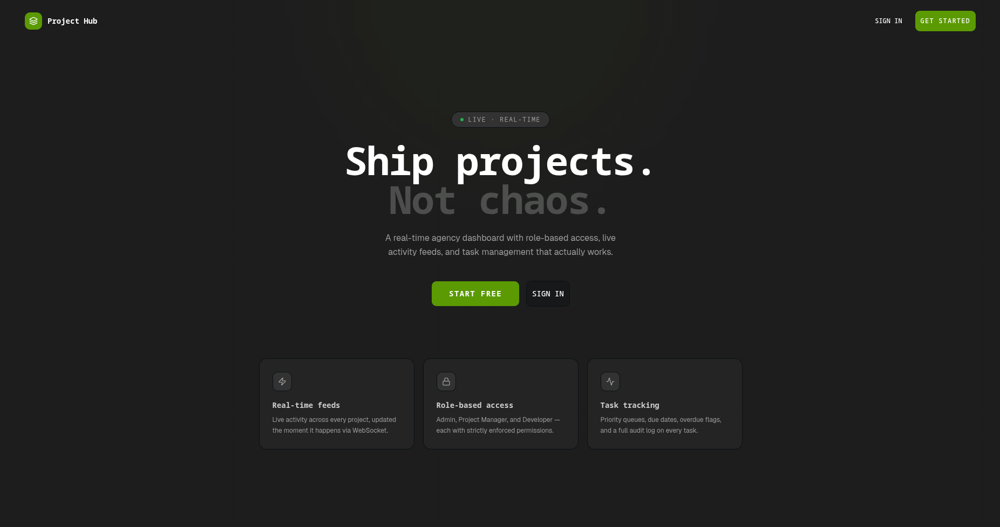

# Project Hub

A real-time client project dashboard with role-based access control, live activity feeds, and WebSocket-powered notifications — built for internal agency use.

[Live demo](https://project-hub-3yp6.onrender.com/)

---

## 📸 Preview



---

## Table of Contents

- [Quick Start (Docker)](#quick-start-docker)
- [Local Development (No Docker)](#local-development-no-docker)
- [Seed Accounts](#seed-accounts)
- [Database Schema](#database-schema)
- [Architectural Decisions](#architectural-decisions)
- [Known Limitations](#known-limitations)
- [Explanation](#explanation)

---

## Quick Start (Docker)

**Prerequisites:** Docker Desktop (or Docker Engine + Compose v2)

```bash
# 1. Clone the repository
git clone https://github.com/whogoodluck/project-hub.git
cd project-hub

# 2. Copy the environment file
cp .env.example .env
# Edit .env and set strong JWT secrets before deploying to any real environment

# 3. First run — build image, run migrations, and seed demo data
SEED_DB=true docker compose up --build

# Visit http://localhost:5000
```

On subsequent runs (data already seeded):

```bash
docker compose up
```

To reset and reseed from scratch:

```bash
docker compose down -v          # removes the postgres volume
SEED_DB=true docker compose up --build
```

### What happens on startup

The container entrypoint (`docker-entrypoint.sh`) runs in order:

1. `prisma migrate deploy` — applies all pending migrations to the database
2. `tsx prisma/seed.ts` — only if `SEED_DB=true` in the environment
3. `node dist/index.js` — starts the Express + Socket.io server

---

## Local Development (No Docker)

**Prerequisites:** Node.js ≥ 22, PostgreSQL ≥ 15

```bash
# 1. Install backend dependencies
npm install

# 2. Install frontend dependencies
cd web && npm install && cd ..

# 3. Configure environment
cp .env.example .env
# Fill in DATABASE_URL and both JWT secrets

# 4. Run migrations
npx prisma migrate dev

# 5. Generate Prisma client
npx prisma generate

# 6. Seed demo data
npx tsx prisma/seed.ts

# 7. Start the backend (port 5000, hot-reload)
npm run dev

# 8. In a second terminal, start the frontend (port 5173, HMR)
cd web && npm run dev
```

The Vite dev server proxies `/api/*` and the WebSocket connection to `localhost:5000`, so no CORS configuration is needed during development.

### Useful scripts

| Command                       | Description                      |
| ----------------------------- | -------------------------------- |
| `npm run dev`                 | Start backend with `tsx --watch` |
| `npm run build:all`           | Build frontend then backend      |
| `npm run studio`              | Open Prisma Studio (DB browser)  |
| `npx tsx prisma/seed.ts`      | Re-seed the database             |
| `cd web && npm run dev`       | Start Vite dev server            |
| `cd web && npm run typecheck` | TypeScript type check (no emit)  |

---

## Seed Accounts

| Email           | Password      | Role            | Access                                           |
| --------------- | ------------- | --------------- | ------------------------------------------------ |
| `admin@hub.dev` | `Admin1234!`  | ADMIN           | All projects, all tasks, all users, all activity |
| `pm1@hub.dev`   | `Manager123!` | PROJECT_MANAGER | TechNova + Bright Finance projects only          |
| `pm2@hub.dev`   | `Manager123!` | PROJECT_MANAGER | GreenLeaf project only                           |
| `dev1@hub.dev`  | `Dev12345!`   | DEVELOPER       | Only tasks assigned to Sam                       |
| `dev2@hub.dev`  | `Dev12345!`   | DEVELOPER       | Only tasks assigned to Nina                      |
| `dev3@hub.dev`  | `Dev12345!`   | DEVELOPER       | Only tasks assigned to Arjun                     |
| `dev4@hub.dev`  | `Dev12345!`   | DEVELOPER       | Only tasks assigned to Zara                      |

The seed creates **3 projects**, **18 tasks** (including 2 already overdue), **12 activity log entries**, and **11 notifications** that demonstrate every role boundary.

---

## Database Schema

### Entity Relationship Overview

```
User ──────────────────────────────────────────────────────────┐
 │  1:N  RefreshToken (hashed, rotated on every use)           │
 │  1:N  Project (as manager)                                  │
 │  1:N  Task (as assignee)                                    │
 │  1:N  ActivityLog (as actor)                                │
 │  1:N  Notification (as recipient)                           │
 └──────────────────────────────────────────────────────────── │

Client ──────────────────────────────────────────────────────── │
 └─ 1:N  Project                                               │
                                                               │
Project ──────────────────────────────────────────────────────── │
 │  FK → Client                                                │
 │  FK → User (manager)  ◄──────────────────────────────────── │
 │  1:N  Task                                                  │
 └─ 1:N  ActivityLog                                           │
                                                               │
Task                                                           │
 │  FK → Project                                               │
 │  FK → User (assignee, nullable)                            │
 │  1:N  ActivityLog                                           │
 └─ 1:N  Notification                                          │
                                                               │
ActivityLog                                                    │
 │  FK → Project                                               │
 │  FK → Task (nullable, preserved on task delete)             │
 │  FK → User (actor)                                          │
 └─ affectedAssigneeId (non-FK string, for developer feed)     │
                                                               │
Notification                                                   │
 │  FK → User (recipient)                                      │
 └─ FK → Task (nullable)                                       │

PresenceSession
 │  FK → User
 └─ socketId (unique), optional projectId
```

### Tables

#### `users`

| Column                | Type          | Notes                                   |
| --------------------- | ------------- | --------------------------------------- |
| id                    | UUID PK       |                                         |
| name                  | String        |                                         |
| email                 | String UNIQUE |                                         |
| password              | String        | bcrypt, cost 12                         |
| role                  | Enum          | `ADMIN \| PROJECT_MANAGER \| DEVELOPER` |
| isActive              | Boolean       | false blocks login                      |
| createdAt / updatedAt | DateTime      |                                         |

**Indexes:** `email` (unique login lookup), `role` (filter by role)

#### `refresh_tokens`

| Column    | Type            | Notes                         |
| --------- | --------------- | ----------------------------- |
| id        | UUID PK         |                               |
| token     | String UNIQUE   | SHA-256 hash of the raw token |
| userId    | UUID FK → users | cascade delete                |
| expiresAt | DateTime        | 7 days                        |
| revoked   | Boolean         | set on rotation or signout    |

**Indexes:** `userId`, `token`

#### `clients`

| Column                      | Type    | Notes        |
| --------------------------- | ------- | ------------ |
| id                          | UUID PK |              |
| name, email, phone, company | String  | email unique |

**Index:** `name`

#### `projects`

| Column            | Type              | Notes           |
| ----------------- | ----------------- | --------------- |
| id                | UUID PK           |                 |
| name, description | String            |                 |
| clientId          | UUID FK → clients | restrict delete |
| managerId         | UUID FK → users   | restrict delete |
| isArchived        | Boolean           |                 |

**Indexes:** `managerId` (PM scoping), `clientId`, `createdAt`

#### `tasks`

| Column             | Type                       | Notes                                                 |
| ------------------ | -------------------------- | ----------------------------------------------------- |
| id                 | UUID PK                    |                                                       |
| title, description | String                     |                                                       |
| projectId          | UUID FK → projects         | cascade delete                                        |
| assigneeId         | UUID FK → users (nullable) | set null on user delete                               |
| status             | Enum                       | `TODO \| IN_PROGRESS \| IN_REVIEW \| DONE \| OVERDUE` |
| priority           | Enum                       | `LOW \| MEDIUM \| HIGH \| CRITICAL`                   |
| dueDate            | DateTime (nullable)        |                                                       |
| isOverdue          | Boolean                    | set by cron job, cleared on status update             |

**Indexes:** `(assigneeId, status)` — developer task list; `(projectId, status)` — project task list with filter; `(dueDate, isOverdue)` — cron job scan; `(priority, dueDate)` — sorted task lists

#### `activity_logs`

| Column                | Type                       | Notes                                |
| --------------------- | -------------------------- | ------------------------------------ |
| id                    | UUID PK                    |                                      |
| projectId             | UUID FK → projects         | cascade delete                       |
| taskId                | UUID FK → tasks (nullable) | set null on task delete              |
| actorId               | UUID FK → users            | cascade delete                       |
| message               | String                     | human-readable description           |
| affectedAssigneeId    | String (nullable)          | used for developer-scoped feed query |
| fromStatus / toStatus | Enum (nullable)            | for status-change display            |
| createdAt             | DateTime                   | immutable, append-only               |

**Indexes:** `(projectId, createdAt DESC)` — PM/Admin project feed; `(affectedAssigneeId, createdAt DESC)` — developer feed; `createdAt DESC` — global admin feed

#### `notifications`

| Column      | Type                       | Notes                                                               |
| ----------- | -------------------------- | ------------------------------------------------------------------- |
| id          | UUID PK                    |                                                                     |
| recipientId | UUID FK → users            | cascade delete                                                      |
| taskId      | UUID FK → tasks (nullable) | set null on task delete                                             |
| type        | Enum                       | `TASK_ASSIGNED \| TASK_IN_REVIEW \| TASK_STATUS_CHANGED \| GENERAL` |
| message     | String                     |                                                                     |
| isRead      | Boolean                    |                                                                     |
| createdAt   | DateTime                   |                                                                     |

**Indexes:** `(recipientId, isRead)` — unread count query; `(recipientId, createdAt DESC)` — sorted notification list

#### `presence_sessions`

| Column                 | Type              | Notes                |
| ---------------------- | ----------------- | -------------------- |
| id                     | UUID PK           |                      |
| userId                 | UUID FK → users   | cascade delete       |
| socketId               | String UNIQUE     | Socket.io socket id  |
| projectId              | String (nullable) | current project room |
| connectedAt / lastPing | DateTime          |                      |

**Indexes:** `userId`, `projectId`, `socketId`

---

## Architectural Decisions

### WebSocket Library: Socket.io

**Choice:** Socket.io over native `ws` / browser WebSocket.

**Reasoning:**

The assignment required per-project rooms, per-user private channels, and presence tracking — all mapped directly to Socket.io's built-in `room` primitive. Emitting `activity:new` to `project:{id}` broadcasts only to users currently viewing that project. `user:{id}` rooms deliver private notifications without any routing logic in application code.

Additional benefits:

- **Authentication middleware** on the `io.use()` hook validates the JWT before the handshake completes — unauthenticated clients never get a socket.
- **Automatic reconnection** with exponential backoff means transient network drops self-heal without frontend logic.
- **Fallback transports** (xhr-polling) handle environments where WebSocket is blocked, though production uses WebSocket only (`transports: ['websocket']`).

The tradeoff is ~10 KB of extra bundle on the client. For this workload that is negligible.

---

### Background Jobs: node-cron

**Choice:** `node-cron` over Bull/BullMQ.

**Reasoning:**

The overdue task job is a simple bulk `UPDATE` that runs every 15 minutes:

```sql
UPDATE tasks
SET is_overdue = true, status = 'OVERDUE'
WHERE is_overdue = false
  AND status NOT IN ('DONE', 'OVERDUE')
  AND due_date < NOW()
```

This is a maintenance sweep — not a per-event job queue. `node-cron` handles it with zero infrastructure overhead: no Redis, no worker process, no dead-letter queue. The job is defined in `src/jobs/overdue.job.ts` and registered at server startup in `src/index.ts`.

**When Bull would be the right choice:** if the overdue event needed to trigger per-task side effects (emails, Slack messages, webhooks) that require retries and delivery guarantees, Bull's queue semantics would be appropriate. For a bulk DB write on a schedule, they add unnecessary complexity.

---

### Token Storage

| Token         | Storage           | Path           | Expiry     |
| ------------- | ----------------- | -------------- | ---------- |
| Access token  | `HttpOnly` cookie | `/`            | 15 minutes |
| Refresh token | `HttpOnly` cookie | `/api/v1/auth` | 7 days     |

**Why HttpOnly cookies instead of localStorage:**

Tokens in `localStorage` are accessible to any JavaScript running on the page — including injected scripts from XSS vulnerabilities. `HttpOnly` cookies are invisible to JavaScript entirely; the browser attaches them automatically and they cannot be read or stolen via `document.cookie`.

`SameSite=strict` prevents cross-site request forgery (CSRF) without requiring a separate CSRF token, because the cookie will never be sent on cross-origin requests initiated from another site.

**Refresh token rotation:**

Every `/auth/refresh` call:

1. Verifies the incoming raw refresh token against its SHA-256 hash stored in the DB
2. Marks the old `RefreshToken` record as `revoked = true`
3. Issues a new access token and a new refresh token
4. Stores the hash of the new refresh token

If a stolen refresh token is replayed after the legitimate user has already rotated it, the token lookup returns `revoked = true` and the request is rejected.

### ORM: Prisma

Type-safe queries generated directly from `schema.prisma` eliminate an entire class of runtime errors. Schema drift is caught at compile time via the generated client. `prisma migrate` provides version-controlled, reviewable migrations. The `PrismaPg` adapter uses a persistent connection pool via `node-postgres` rather than opening a new connection per query.

---

### Backend: Express v5

Express was chosen over Fastify for its larger ecosystem and familiar middleware model. Express v5 ships with native async error handling — uncaught promise rejections in route handlers automatically propagate to the `errorHandler` middleware, eliminating the need for `try/catch` in every controller.

---

### Frontend: React + TanStack Query

TanStack Query manages all server state (caching, background refetch, optimistic updates) while React state handles only ephemeral UI state (open modals, form values). This keeps components free of loading/error boilerplate. The Axios interceptor handles silent token refresh: on a `401` response it calls `/auth/refresh`, then retries the original request — the component never knows the token expired.
